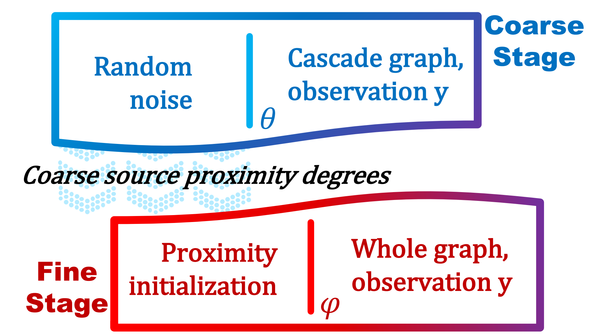

- This is the repository for the paper "Two-stage Denoising Diffusion Model for Source Localization in Graph Inverse Problems".

- The code has been tested under Pytorch 2.0.

- Datasets names are 'Digg', 'Memetracker', 'Android', 'Christianity', 'Twitter'.

## Model Overview
Two stage framework:

 

which is composed  by the **coarse initialization stage**:

and the **fine stage**:

